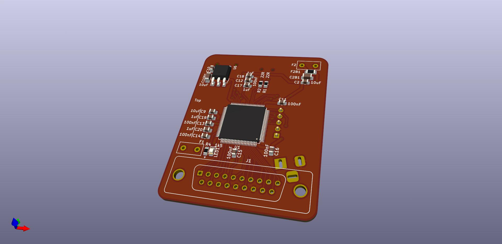
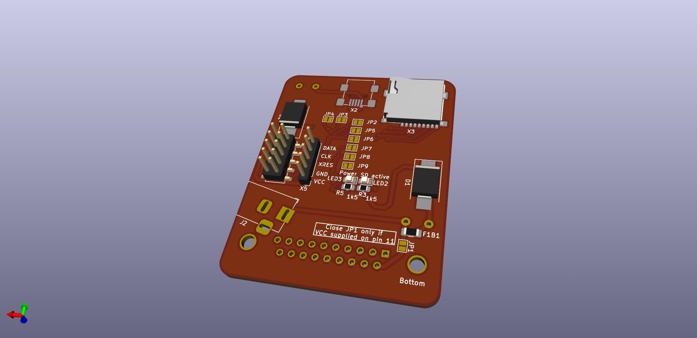

# ACSI2SD-Proc
version for QFP100 controller
ACSI0123_512M.xml contains default configuration for scsi2sd-util

# Hardware - finally with placement help and board layout

- Board layout isn't the original layout, it's just for helping with rough position of parts
- DRC/ERC passing
- interactive BOM in kicad folder

Board Render Front           |  Board Render Back
:-------------------------:|:-------------------------:
 | 
